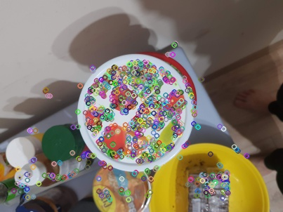
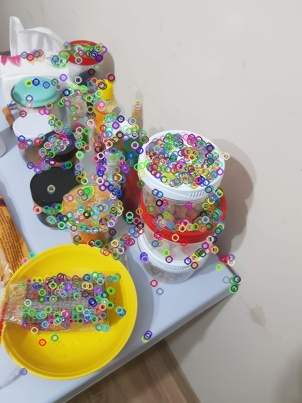

Feature-matching using BRISK
============================


#### using an open-source alternative to SIFT


I wanted an app that takes two images and detects the position of the first image in the second, I also didn’t want to use Artificial intelligence.

What I need to do can be summed up in three steps:

1\. find good keypoints (or features) on the first image

2\. do the same on the second image

3\. match the keypoints of the first image to those of the second


Simple enough won’t you say?! lets see our options

For a task this simple I didn’t want to use AI, I just started learning AI and I’m a total noob, the next best thing is an algorithm called SIFT!

**SIFT**
--------

scale-invariant feature transform (**SIFT**) is a feature detection algorithm in computer vision to detect and describe local features in images, it was developed by David Lowe in 1999 and both the algorithm and it’s developer are very famous in the field of CV, **But,** it is patented!

**BRISK**
---------

BRISK is a feature point detection and description algorithm with scale invariance and rotation invariance, developed in 2011 as a free alternative to SIFT and readily implemented in famous CV libraries such as OpenCV

Step one: finding features
--------------------------

to illustrate I will use the following two images:


image 1


image 2

we need to compute feature points on both images, these are points the the algorithm deems as recognizable or interesting

```
detector = cv.BRISK\_create()norm = cv.NORM\_HAMMINGkp1, desc1 = detector.detectAndCompute(img1, None)
```

we initiate a detector object, and use it to compute the features and descriptors of each point, descriptors will help us match the points between the images, here is the results of the first step



and the same for image 2




now to the fun part, we match the two images,

```
FLANN\_INDEX\_LSH    = 6flann\_params= dict(algorithm = FLANN\_INDEX\_LSH,table\_number = 6, _\# 12_key\_size = 12,     _\# 20_multi\_probe\_level = 1) _#2_matcher = cv.FlannBasedMatcher(flann\_params, {})raw\_matches = matcher.knnMatch(desc1, trainDescriptors = desc2, k = 2)
```

FLANN is a matcher object, it will give us matches that may contain some inaccuracy, to eliminate inaccurate points we use Low’s ratio test, here I’ve made a function for that

I also want to draw a bounding box around the detected object, I will do this using Homography, simply put, I will project the borders of my first image on its new location in the second image, here is what that looks like


